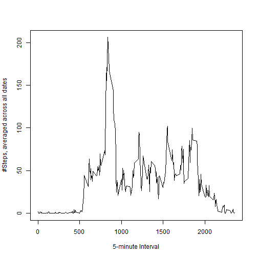

### Loading and preprocessing the data

```r
library(plyr)
library(lattice)
activity <- read.csv("activity.csv")
head(activity)
```

```
##   steps       date interval
## 1    NA 2012-10-01        0
## 2    NA 2012-10-01        5
## 3    NA 2012-10-01       10
## 4    NA 2012-10-01       15
## 5    NA 2012-10-01       20
## 6    NA 2012-10-01       25
```
We load plyr and lattice for future data processing and plotting.

The working directory for knitr must be properly set using `setwd()`
as it may differ from the default for Rstudio.


### What is mean total number of steps taken per day?

```r
activity$date <- as.Date(activity$date)
activitydate <- ddply(activity, .(date), function(x){sum(x$steps)})
head(activitydate)
```

```
##         date    V1
## 1 2012-10-01    NA
## 2 2012-10-02   126
## 3 2012-10-03 11352
## 4 2012-10-04 12116
## 5 2012-10-05 13294
## 6 2012-10-06 15420
```


We sum the steps over each day


```r
hist(activitydate$V1, 
     breaks = 20, 
     xlab = "Steps per Day", 
     main = "Distribution of steps per day")
```

 


The distribution of steps is sorted into 20 bins.
We could have used more by increasing `breaks = 20` and obtained a smoother histogram


```r
summary(activitydate$V1)
```

```
##    Min. 1st Qu.  Median    Mean 3rd Qu.    Max.    NA's 
##      41    8841   10760   10770   13290   21190       8
```
The mean and median total number of steps taken per day are shown in the summary above.

### What is the average daily activity pattern?


```r
meanstepsinterval <- ddply(activity,
                           .(interval),
                           function(x){mean(x$steps, na.rm = TRUE)})

plot(meanstepsinterval$interval, 
     meanstepsinterval$V1, 
     type = "l",
     xlab = "5-minute Interval",
     ylab = "#Steps, averaged across all dates")
```

 

```r
maxsteps <- max(meanstepsinterval$V1)
maxstepsrow <- grep(maxsteps, meanstepsinterval$V1)
maxinterval <- meanstepsinterval[maxstepsrow,1]
```
The 5-minute interval with the greatest number of steps per day on average began at 835 minutes. It averaged 206.1698113 steps in this interval.

### Inputing missing values


```r
replaceNA <- function(x)
{
        if (is.na(x[[1]]) == TRUE)
        {
                intindex <- as.numeric(x[[3]])
                intdummy <- meanstepsinterval[meanstepsinterval[,1] == intindex, 2]
                return(intdummy)
        }
        else
                return(as.numeric(x[[1]]))
}
```

We define a function which will find missing values in the steps column (1st col) of a data input. If they are present we use the value in the interval column (3rdcol) as an index to find the mean for that interval, which was defined in the previous step of the exercise. 


```r
dummyactivities <- apply(activity, 1, replaceNA)
dummyvec <- as.vector(dummyactivities)

NoNA_activity <- activity
NoNA_activity$steps <- dummyvec
```

We apply our function on the activity data to produce a vector with NA values replaced by 5-minute interval means. These values replace $steps in our new NoNA data frame.


```r
NoNA_activitydate <- ddply(NoNA_activity, .(date), function(x){sum(x$steps)})
hist(NoNA_activitydate$V1, 
     breaks = 20, 
     xlab = "Steps per Day", 
     main = "Distribution of steps per day")
```

 

```r
summary(NoNA_activitydate$V1)
```

```
##    Min. 1st Qu.  Median    Mean 3rd Qu.    Max. 
##      41    9819   10770   10770   12810   21190
```
After replacing the NAs with 5-minute interval means, we see that the distribution becomes narrower compared to our previous plot. The 1st and 3rd quartiles have become closer to the mean, and the mean is now identical to the median.

### Are there differences in activity patterns between weekdays and weekends

```r
weekdaysa <- weekdays(NoNA_activity$date)
weekdaysb <- mapvalues(weekdaysa, c("Monday","Tuesday","Wednesday","Thursday","Friday","Saturday","Sunday"), c("Weekday","Weekday","Weekday","Weekday","Weekday","Weekend","Weekend"))
weekdaysc <- as.factor(weekdaysb)
NoNA_activity$date <- weekdaysc
```
Here we

* Transform the dates into days of the week
* Map days of the week to weekdays and weekends
* Transform these from character to factor variables 
* Put them back into our dataframe.

```r
Weekdays_meanstepsinterval <- ddply(NoNA_activity,
                           .(date, interval),
                           function(x){mean(x$steps, na.rm = TRUE)})
Weekdays_meanstepsinterval$interval <- as.numeric(Weekdays_meanstepsinterval$interval)
```
Next we average The number of steps across all weekdays or weekends for each 5-minute interval.


```r
xyplot(V1~interval | date, data = Weekdays_meanstepsinterval, 
       type = "l",        
       ylab = "# of steps", 
       layout = c(1,2),
       xlab = "5-minute interval")
```

 
